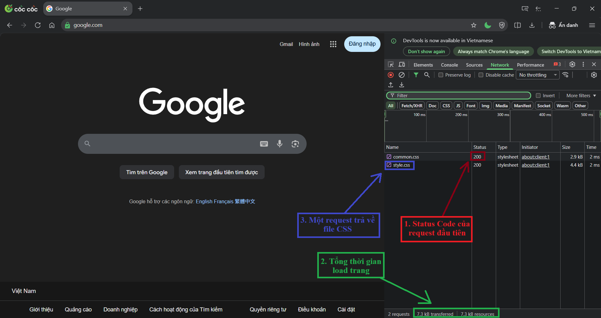
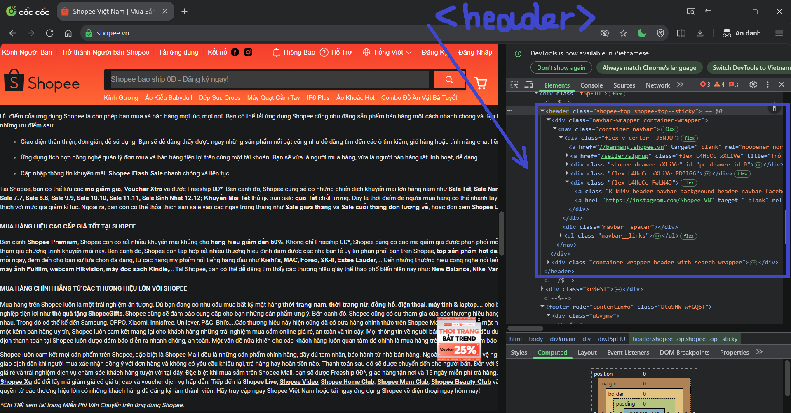
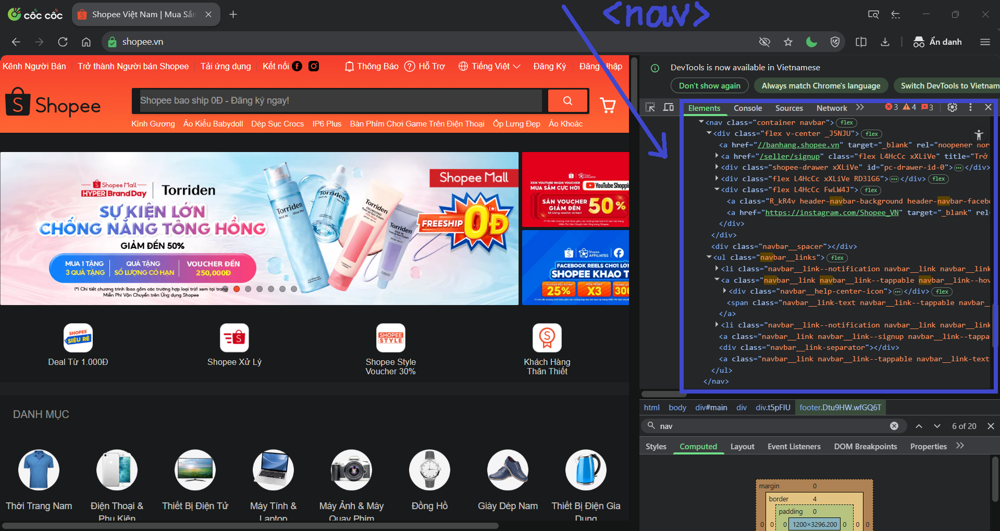
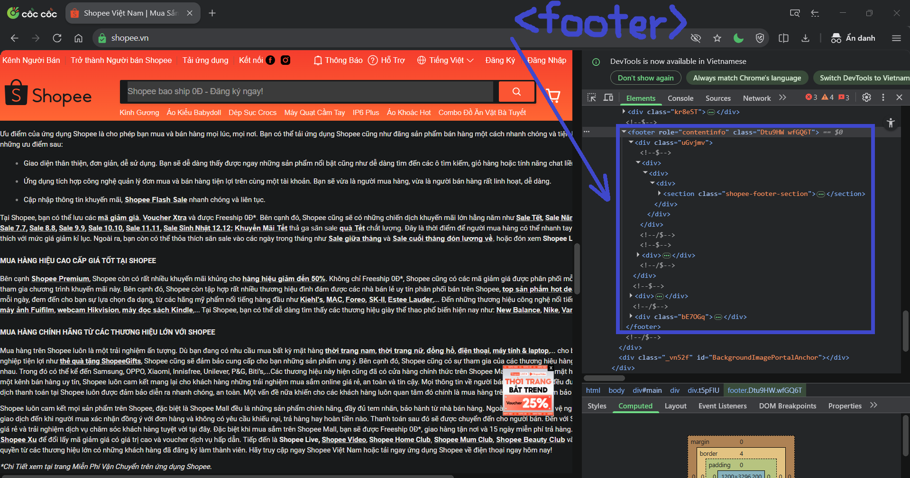
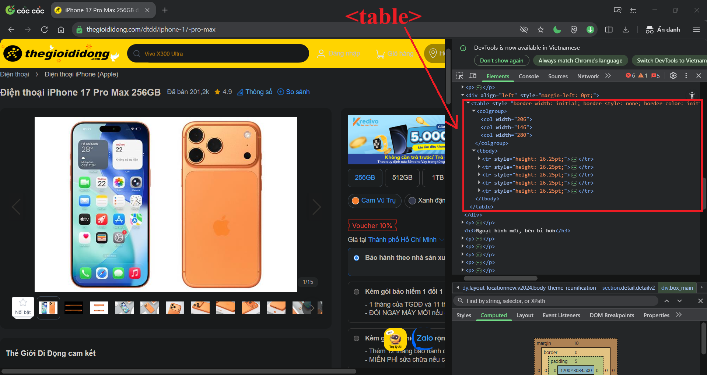
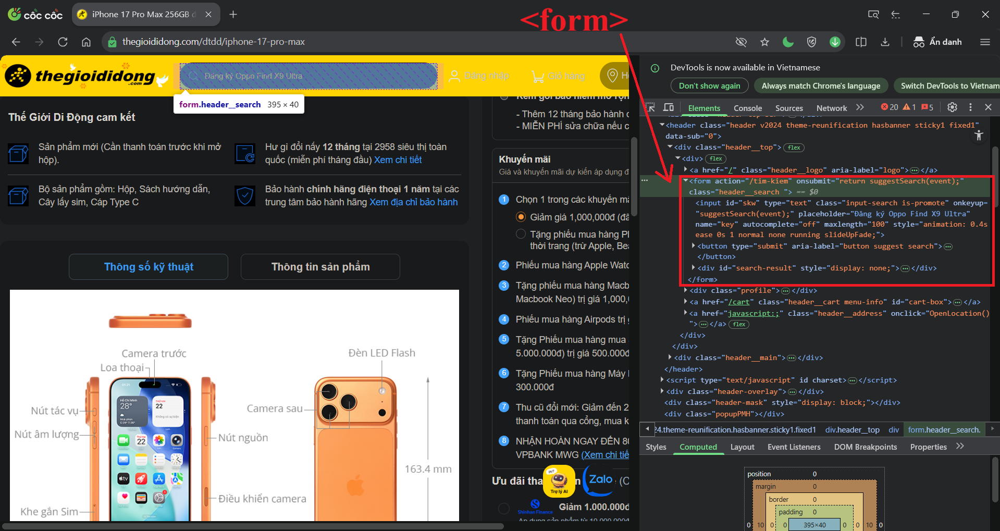

PHẦN A - KIỂM TRA ĐỌC HIỂU

Câu A1:
1. Khi gõ https://shopee.vn vào trình duyệt và nhấn Enter, 5 bước xảy ra (từ DNS lookup đến render) là:
- DNS Lookup: Tìm địa chỉ IP của `shopee.vn`.
- TCP Handshake: Thiết lập kết nối giữa Client và Server.
- HTTP Request: Trình duyệt gửi yêu cầu lấy file HTML.
- Server Response: Server gửi trả lại dữ liệu.
- Browser Rendering: Trình duyệt đọc HTML/CSS/JS để vẽ giao diện.
2. 
- Trong DevTools của Chrome, tab Network cho thấy thông tin về các yêu cầu/phản hồi giữa trình duyệt và máy chủ, giúp theo dõi thời gian tải và kích thước file.
- Ảnh phân tích 1 trang web (VD: truy cập `google.com`  ) theo 3 yêu cầu:
    1. Status Code của request đầu tiên
    2. Tổng thời gian load trang
    3. Một request trả về file CSS

Câu A2:
- Trang web bị Google đánh giá SEO thấp vì có các lỗi sau đây:
    1. `
` -> `<header>`: Định nghĩa phần đầu trang.
    2. `
` -> `<nav>`: Khu vực điều hướng.
    3. `
` -> `<main>`: Nội dung chính duy nhất.
    4. `
` -> `<article>`: Sản phẩm là nội dung độc lập.
    5. `
` -> `<footer>`: Chân trang.

Câu A3:
- Text art:
    Hộp 1
    Text AText B
    Hộp 2
    Text CText D
    Hộp 3
- Giải thích
    + Phần tử Block (
): * Các thẻ 
Hộp 1
, 
Hộp 2
, và 
Hộp 3
 là các block-level elements. Luôn bắt đầu trên một dòng mới và chiếm trọn vẹn chiều ngang của phần tử chứa nó.
    + Phần tử Inline (, <strong>): * Các thẻ Text A, Text B, Text C, và <strong>Text D</strong> là các inline elements. Chỉ chiếm không gian vừa đủ với nội dung bên trong và không tạo ra dòng mới.

Câu A4:
- <thead>: Table Header - Chứa các hàng tiêu đề của bảng (thường là các thẻ <th>). Giúp xác định các cột đang biểu thị dữ liệu gì.
- <tbody>: Table Body - Chứa nội dung dữ liệu chính của bảng. Đây là phần lớn nhất của bảng, nơi các giá trị thực tế được trình bày.
- <tfoot>: Table Footer - Chứa thông tin tổng kết của bảng.

Phần B - Thực hành Code:

Câu B3 - Debug HTML
- Dòng 1 — Khai báo <!DOCTYPE> thiếu html — Sửa thành <!DOCTYPE html>.
- Dòng 2 — Thẻ <title> chưa đóng — Thêm thẻ đóng </title> sau nội dung tiêu đề.
- Dòng 3 — Thuộc tính charset ghi sai utf8 — Sửa thành UTF-8 và đưa lên trên thẻ <title> để trình duyệt đọc sớm nhất.
- Dòng 4 — Thẻ <h1> đóng sai cú pháp (ghi là <h1> thay vì </h1>) — Sửa thành </h1>.
- Dòng 8 — Thẻ <a> của link Trang chủ đóng sai (<a>) — Sửa thành </a>.
- Dòng 15 — Thẻ  thiếu dấu ngoặc kép cho thuộc tính và thiếu thuộc tính alt (quan trọng cho accessibility) — Sửa thành .
- Dòng 17 — Sai thứ tự đóng thẻ lồng nhau (đóng 
 trước <b>) — Sửa thành <b>...</b>
.
- Dòng 20-30 — Bảng dữ liệu thiếu thẻ tiêu đề <th> (semantic) — Thay <td> hàng đầu tiên bằng <th>.
- Dòng 33 — Sử dụng thẻ <main> lần thứ hai — HTML chuẩn chỉ cho phép duy nhất một thẻ <main>. Sửa thành thẻ <aside> vì đây là nội dung sidebar.
- Dòng 37 — Thẻ 
 trong footer chưa có thẻ đóng — Thêm 
 sau nội dung Copyright.
- Tổng thể — Cấu trúc thiếu tính logic: thẻ <h1> nên nằm trong <header> để đúng cấu trúc phân cấp trang.

Câu B4 - Phân tích trang web thật
1. 3 thẻ semantic HTML: 
        
        
        
2. 
- Truy cập trang web `thegioididong.com`, chọn 1 sản phẩm bất kỳ và nhấn phím F12 để tìm table , table hiển thị thông số kỹ thuật của sản phẩm đó.
- Trang web`thegioididong.com` có sử dụng <tbody> nhưng không sử dụng <thead>.
3.
- Truy cập trang web `thegioididong.com`, chọn ô tìm kiếm và nhấn phím F12 để tìm form  :
    + action(/tim-kiem), method(GET)
    + Input types được sử dụng: type="text"(ô nhập liệu chính), type="submit"(nút bấm)

PHẦN C - Suy luận:

Câu C1 - Thiết kế cấu trúc
<header> <nav> <ul>
            <li><a href="/">Trang chủ</a></li>
        </ul>
    </nav>
</header>

<nav aria-label="breadcrumb"> <ol>
        <li><a href="/">Trang chủ</a></li>
        <li><a href="/mobile">Điện thoại</a></li>
        <li>iPhone 16</li>
    </ol>
</nav>

<main> 

        <section class="product-visuals"> <figure>  <figcaption>Ảnh sản phẩm chính</figcaption>
            </figure>
            </section>
        <article class="product-info"> <h1>iPhone 16 Pro Max</h1> 
<mark>25.990.000đ</mark>
 
⭐⭐⭐⭐⭐
   
            
Mô tả tóm tắt sản phẩm...

        </article>
        <section class="specs"> <h2>Thông số kỹ thuật</h2>
            <table> <thead> <tr>
                        <th>Đặc tính</th>
                        <th>Chi tiết</th>
                    </tr>
                </thead>
                <tbody> <tr>
                        <td>Chipset</td>
                        <td>A18 Pro</td>
                    </tr>
                </tbody>
            </table>
        </section>
        <section class="reviews"> <h2>Đánh giá từ khách hàng</h2>
            <article> 
Sản phẩm rất tốt!

                <time datetime="2026-04-19">19/04/2026</time> </article>
        </section>
    

    <aside> <h3>Sản phẩm tương tự</h3>
        </aside>
</main>

<footer> 
&copy; 2026 Shop Mobile. All rights reserved.

</footer>
Câu C2 - So sánh và tranh luận
- Việc cho rằng chỉ cần dùng 
 kết hợp class là đủ mà không cần Semantic HTML là một tư duy thiếu hụt về kỹ thuật. Semantic HTML không chỉ là "tên thẻ", mà là nền tảng để trình duyệt và các bộ máy thông minh hiểu được website.
    + Thứ nhất, về mặt SEO (Search Engine Optimization): Các bộ máy tìm kiếm như Google dựa vào các thẻ như <header>, <main>, <article> để xác định đâu là nội dung quan trọng. Nếu mọi thứ đều là 
, "Google Bot" sẽ mất rất nhiều thời gian để phân tích, dẫn đến việc website bị tụt hạng so với các đối thủ sử dụng cấu trúc chuẩn (Tham chiếu Chương 04).
    + Thứ hai, về mặt Accessibility (Khả năng tiếp cận): Những người khiếm thị sử dụng phần mềm đọc màn hình (Screen Reader) phụ thuộc hoàn toàn vào Semantic HTML để điều hướng. Ví dụ, khi dùng thẻ <nav>, người dùng có thể nhảy nhanh tới menu chính. Nếu thay bằng 
, họ sẽ bị lạc lối trong một "biển" dữ liệu không tên.
- Ví dụ cụ thể chứng minh semantic HTML giúp ích: Khi ta dùng thẻ <time datetime="2026-04-19">, trình duyệt không chỉ hiện chữ mà còn có thể gợi ý người dùng thêm vào lịch (Calendar). Nếu chỉ dùng 
19/04
, trình duyệt chỉ coi đó là một chuỗi ký tự vô hồn.
- Trường hợp cụ thể 
 vẫn có chỗ đứng riêng: Trong thực tế, 
 vẫn cực kỳ phù hợp khi chúng ta cần tạo ra các "hộp bọc" (wrapper) chỉ nhằm mục đích dàn trang (Layout) hoặc tạo style cho CSS (như tạo một container để căn giữa trang) mà bản thân cái hộp đó không mang ý nghĩa nội dung cụ thể nào.