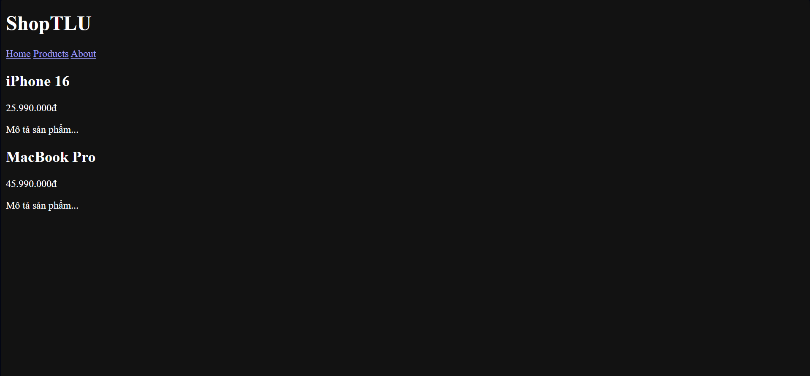

PHẦN A — KIỂM TRA ĐỌC HIỂU

Câu A1 — 3 Cách nhúng CSS
1. Inline CSS
- Ví dụ:

Hello

- Ưu điểm:
    + Áp dụng nhanh cho 1 phần tử
    + Không cần file riêng
- Nhược điểm:
    + Không tái sử dụng
    + Khó maintain
    + Làm HTML rối
- Khi nên dùng:
    + Test nhanh
    + Override tạm thời
2. Internal CSS
- Ví dụ:
<head>
  
</head>
<body>
  
Hello

</body>
- Ưu điểm:
    + Dễ quản lý hơn inline
    + Áp dụng cho toàn trang
- Nhược điểm:
    + Không dùng lại giữa nhiều trang
    + Code CSS vẫn nằm trong HTML
- Khi nên dùng:
    + Trang đơn
    + Prototype / demo
3. External CSS
Ví dụ:

HTML:
<link rel="stylesheet" href="styles.css">

Hello

CSS (styles.css):
p {
  color: green;
  font-size: 18px;
}
- Ưu điểm:
    + Tái sử dụng nhiều trang
    + Dễ bảo trì
    + Browser cache → load nhanh hơn
- Nhược điểm:
    + Cần thêm file
    + Phải load file CSS
- Khi nên dùng:
    + Dự án thật
    + Website nhiều trang

Câu A2 — CSS Selectors — Dự đoán kết quả
1. h1 → Chọn:
ShopTLU
2. .price → Chọn:
25.990.000đ
45.990.000đ
3. #app header → Chọn:
ShopTLU
Home
Products
About
4. nav a:first-child → Chọn:
Home
5. .product.featured h2 → Chọn:
MacBook Pro
6. article > p → Chọn:
25.990.000đ
Mô tả sản phẩm...
45.990.000đ
Mô tả sản phẩm...
7. a[href="/"] → Chọn:
Home
8. .top-bar.dark h1 → Chọn:
ShopTLU

Câu A3 — Box Model — Tính toán kích thước
- Trường hợp 1: content-box (mặc định)
    + Chiều rộng hiển thị = 400 + 20×2 + 5×2 = 450px
    + Không gian chiếm trên trang (tính cả margin) = 450 + 10×2 = 470px
- Trường hợp 2: border-box
    + Chiều rộng hiển thị = 400px (padding + border đã nằm trong 400)
    + Kích thước content thực tế = 400 − 20×2 − 5×2 = 350px
    + Không gian chiếm trên trang (tính cả margin) = 400 + 10×2 = 420px
- Trường hợp 3: Margin collapse
    + Khoảng cách giữa box-a và box-b = 40px
    + Giải thích: margin dọc giữa hai block liền kề không cộng lại, mà “collapse” thành giá trị lớn hơn → max(25, 40) = 40, nên không phải 65px.
- Nâng cao (có margin âm)
    + box-a: margin-bottom = -10px
    + box-b: margin-top = 40px
    + Khoảng cách = 30px
    + Giải thích: khi có margin âm, giá trị collapse = margin dương lớn nhất + margin âm nhỏ nhất → 40 + (−10) = 30px.

Câu A4 — Specificity (Độ ưu tiên)
1. Specificity của từng rule (a, b, c):
    Rule A: p → (0, 0, 1)
    Rule B: .price → (0, 1, 0)
    Rule C: #main-price → (1, 0, 0)
    Rule D: p.price → (0, 1, 1)
2. Element sẽ có màu gì?
    Element: 

    So sánh specificity:
    A: (0,0,1)
    B: (0,1,0)
    C: (1,0,0) ← cao nhất
    D: (0,1,1)
    → Rule C thắng → màu đỏ
3. Nếu thêm inline style
    

    → Inline có độ ưu tiên cao nhất (coi như (1,0,0,0))
    → Kết quả: màu cam
4. Nếu Rule A thêm !important
    p { color: black !important; }
    → !important vượt specificity
    → So sánh:
    Rule A: có !important
    Các rule khác: không có
    → Rule A thắng → màu đen

PHẦN B — THỰC HÀNH CODE

Bài B2 — Box Model Lab
/* PHẦN 1 */
- Hộp 1 (content-box):
    + Chiều rộng thực tế = 350px (content 300 + padding 40 + border 10)
- Hộp 2 (border-box):
    + Chiều rộng thực tế = 300px (đã bao gồm padding + border)
Giải thích:
- content-box: width chỉ tính content → padding + border bị cộng thêm ra ngoài
- border-box: width bao gồm cả content + padding + border → không bị phình kích thước

/* PHẦN 2 */
Nếu KHÔNG dùng border-box:
- Tổng width = 250 + 500 + 250 = 1000px
- Nhưng padding sẽ làm vượt quá 1000px → layout bị tràn
Nếu dùng border-box:
- Padding nằm trong width → tổng vẫn giữ đúng 1000px → layout ổn định

Bài B3 - Specificity Battle
/* 10 RULES + SPECIFICITY */
1. * { color: gray; } → (0,0,0)
2. p { color: black; } → (0,0,1)
3. .text { color: blue; } → (0,1,0)
4. .highlight { color: green; } → (0,1,0)
5. p.text { color: orange; } → (0,1,1)
6. p.highlight { color: pink; } → (0,1,1)
7. .text.highlight { color: purple; } → (0,2,0)
8. #demo { color: red; } → (1,0,0)
9. p#demo { color: brown; } → (1,0,1)
10. body p#demo.highlight { color: hotpink; } → (1,1,2)

ELEMENT CUỐI CÙNG HIỂN THỊ MÀU:
-> hotpink
- LÝ DO:
    + Rule #10 có specificity cao nhất: (1,1,2)
    + Có ID (#demo) → thắng tất cả class và tag
    + Có nhiều selector kết hợp → tăng điểm specificity

THAY ĐỔI THỨ TỰ RULES CÓ ẢNH HƯỞNG KHÔNG?
-> KHÔNG thay đổi kết quả
- GIẢI THÍCH:
    + CSS không ưu tiên theo thứ tự viết (trong trường hợp specificity khác nhau)
    + Trình duyệt luôn chọn rule có specificity cao nhất
    + Chỉ khi specificity bằng nhau thì rule viết sau mới thắng

PHẦN C — DEBUG & SUY LUẬN

Câu C1 — Debug CSS Layout
1. TÍNH CHIỀU RỘNG THỰC TẾ (content-box)
    Sidebar
    width: 300px
    padding: 20px (2 bên = 40px)
    border: 1px (2 bên = 2px)
    -> 300 + 40 + 2 = 342px

    Content
    width: 660px
    padding: 30px (2 bên = 60px)
    border: 1px (2 bên = 2px)
    -> 660 + 60 + 2 = 722px

    Tổng: 342 + 722 = 1064px

2. TẠI SAO LAYOUT BỊ VỠ
    Container chỉ có 960px
    Nhưng 2 cột chiếm 1064px
    Dư thừa 104px
    Float không tự co lại → phần content bị đẩy xuống dòng
    - Nguyên nhân chính: content-box + padding + border làm tăng kích thước thực tế

3. CÁCH SỬA
CÁCH 1 — DÙNG border-box (CHUẨN)
* {
    box-sizing: border-box;
}
Khi đó:
width đã bao gồm padding + border
-> Sidebar = 300px
-> Content = 660px
Tổng = 960px

CÁCH 2 — KHÔNG DÙNG border-box (tự tính lại width)
Sidebar:
300 - 40 - 2 = 258px
Content:
660 - 60 - 2 = 598px
Tổng = 258 + 598 = 856px

Câu C2 — Cascade Puzzle
1. “Sản phẩm A” (h2.title.highlight trong #featured)
    Font-size:
    .card .title { font-size: 20px; } áp dụng
    -> 20px
    Color:
    So sánh các rule:
    .card { color: blue; } -> blue
    #featured .title { color: red; } -> red (ID mạnh hơn class)
    .highlight { color: green !important; } -> !important thắng tất cả
    -> green
2. “Mô tả sản phẩm” (p trong #featured)
    
Mô tả sản phẩm

    Color:
    .card { color: blue; } -> áp dụng cho card
    .card p { color: inherit; } -> kế thừa từ .card
    -> .card có color = blue
    -> p inherit → blue
3. “Sản phẩm B” (h2.title không featured)
    Font-size:
    .card .title { font-size: 20px; }
    -> 20px
    Color:
    .card { color: blue; } → blue
    Không có rule ID override
    .highlight không áp dụng cho h2 này
    -> blue
4. “Mô tả sản phẩm B” (p.highlight)
    
Mô tả sản phẩm B

    Color:
    .highlight { color: green !important; }
    -> !important thắng tất cả
    -> green
